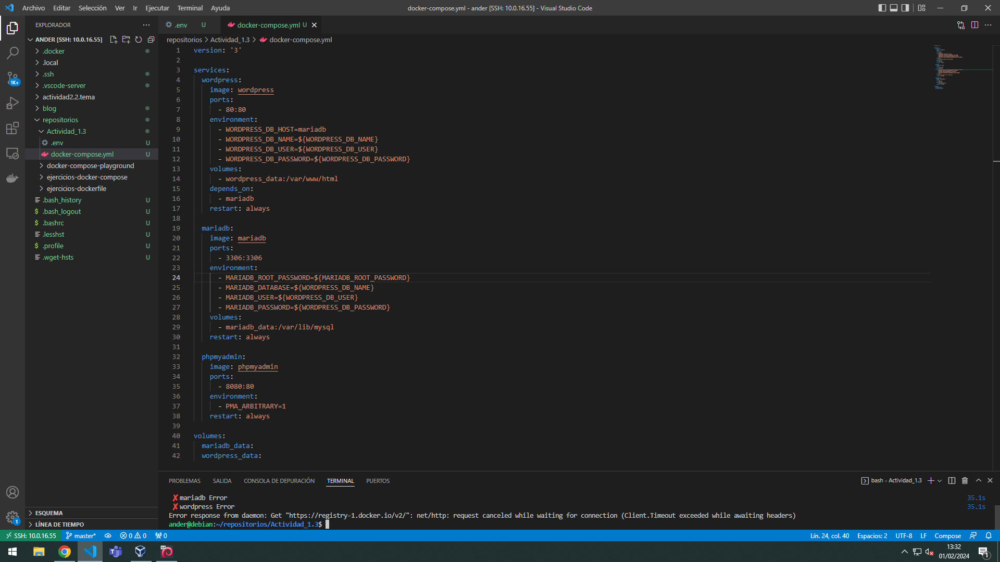
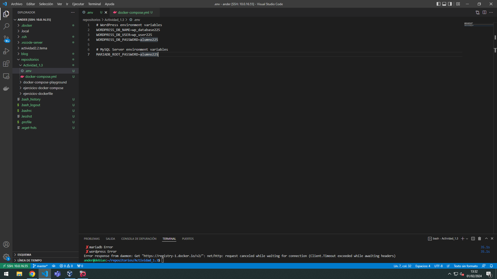
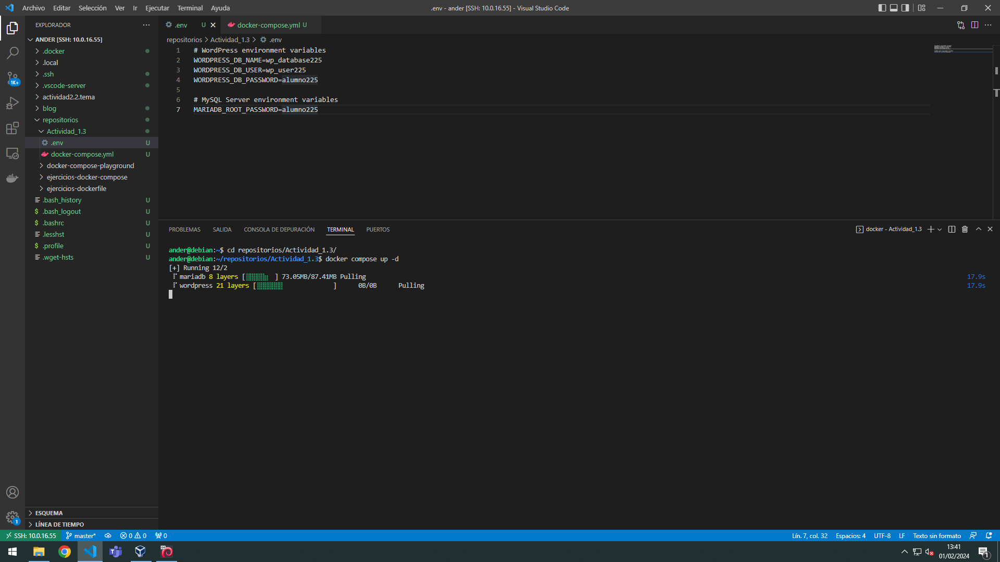
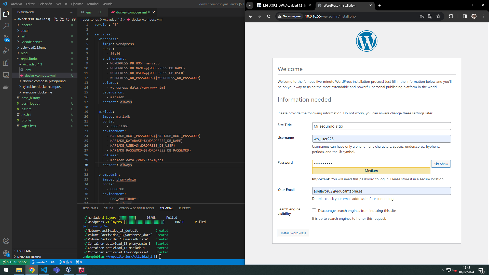
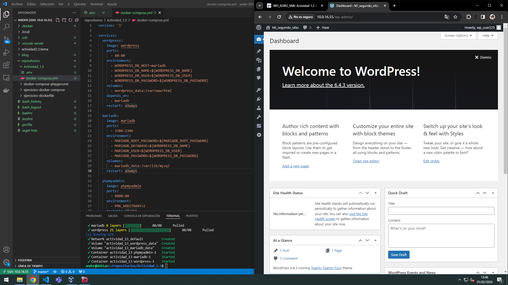

# actividad13_wordpress_dockers
## Ander Pelayo Remesal

1. Para este apartado lo que haremos es coger un direcotiro que tenemos en un repositorio de Luis, en el cual ya viene el php y la base de datos creada. Una vez tenemos el directorio lo que tendremos que hacer es modificar el archivo yml, que quedaria de la siguiente manera

   

2. El siguiente paso que tenemos que hacer es modificar el segundo archivo que seria el .env que quedaria de la siguiente forma   

   

3. Ahora para ejecutar los archivos lo que tendremos que hacer es ejecutar la instruccion `docker compose up -d`

   

4. Una vez cargado el proceso podremos dirigirnos al buscador y poner nuestra IP para ver que efectivamente se carga el Wordpress

   

5. Realizariamos los pasos que se nos piden y finalmente tendriamos la pagina que vemos a continuacion

   